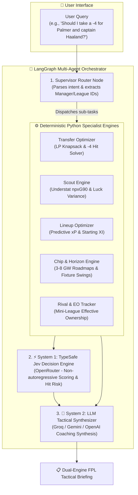

# ⚽ FPL Intelligence Engine & Agentic Dual-Core AI

[](https://www.python.org/downloads/)
[](https://github.com/langchain-ai/langgraph)
[](https://openrouter.ai/)
[](tests/)
[](LICENSE)

A high-performance analytics, optimization, and **Hybrid Agentic AI Engine** for **Fantasy Premier League (FPL)**. 

Powered by a **System 1 / System 2 dual-core architecture**:
* **⚡ System 1 (TypeSafe Jev via OpenRouter)**: High-speed structured decision scoring, hit-risk evaluation, and calibrated confidence estimation.
* **🧠 System 2 (Groq / Gemini / OpenAI)**: Deep conversational synthesis, natural language tactical coaching, and long-term horizon roadmaps.
* **⚙️ Deterministic Solvers**: Combinatorial transfer optimizers (1/2/3 player swaps), -4 hit break-even calculators, Understat xG/xA fuzzy data fusion, and mini-league Effective Ownership (EO) tracking.

---

## 🏛️ System Architecture



---

## 🌟 Key Capabilities & Features

### 1. ⚡ Hybrid Dual-Engine AI (System 1 + System 2)
* **Instant Decision Verdicts**: Emits structured verdicts, urgency scores, and hit-risk levels.
* **Calibrated Confidence**: Machine-rated confidence percentage on every transfer and captaincy call.
* **Graceful Degradation & Zero SPOF**: If the Jev API is unreachable, the system automatically flags `⚠️ Jev: Not Available` and seamlessly falls back to exact deterministic mathematical formulas without crashing.

### 2. 🔍 Understat & Advanced Statistics Fusion
* **Fuzzy Name Resolution**: Bridges official FPL player identities with Understat entities across nicknames and spelling variations.
* **Per-90 Metrics**: Calculates `npxG90`, `xA90`, `xGChain90`, and `xGBuildup90`.
* **Luck Variance ($\Delta\text{xG}$)**: Identifies underperforming players due for a statistical rebound ($Goals < xG$).

### 3. 🔄 Combinatorial Multi-Transfer & Point-Hit (-4) Solver
* **Pair & Triple Swaps**: Analyzes complex multi-player combinations to find maximum net expected point ($\Delta\text{xP}$) uplift.
* **Break-Even Horizon**: Computes the exact future gameweek by which a point deduction ($-4 / -8$) turns net-positive.

### 4. 🗓️ Multi-Gameweek Horizon Projections (3 to 8 GWs)
* **Rolling Projections**: Aggregates projected cumulative points ($\sum xP$) over customizable fixture horizons.
* **Fixture Swing Detection**: Flags teams entering favorable green runs (`Prime Target 🟢`) versus tough schedules (`Toughening 🔴`).

### 5. 🏆 Mini-League Rival Tracker & Effective Ownership (EO)
* **Accurate EO Calculations**: Computes league-wide Effective Ownership ($Starting \% + Captain \% + 2 \times TC \%$).
* **Differential Hunting**: Recommends low-ownership assets to overtake mini-league leaders.

---

## 📂 Project Structure

```
FPl Analyzer/
├── .env.example                  # Environment configuration template
├── requirements.txt              # Standard pip dependencies
├── pyproject.toml                # UV package definition & tool configuration
├── run_agent.py                  # 🚀 Interactive CLI conversational agent
├── debug_api.py                  # Interactive CLI debug & benchmarking hub
├── data/cache/                   # In-memory & disk TTL cache directory
├── debug/                        # Modular component debug runners
│   ├── 01_bootstrap.py           # FPL static bootstrap data inspector
│   ├── 04_manager.py             # Manager squad & team loader
│   ├── 06_understat.py           # Understat scraper & per-90 metrics
│   ├── 08_understat_fusion.py    # Fuzzy player matching verification
│   ├── 10_transfer_optimizer.py  # Combinatorial transfer solver demo
│   └── 14_jev_agent_debug.py     # ⚡ Live Jev & Agent execution debug console
├── tests/                        # Automated Pytest suite (16 tests)
│   ├── test_agent_graph.py       # LangGraph routing & state preservation
│   ├── test_agent_tools.py       # Specialist engine tool adapters
│   └── test_jev_integration.py   # Jev scoring, fallbacks & response formatting
└── src/
    ├── api/                      # FPL & Understat HTTP clients with retry & rate limiting
    ├── cache/                    # Thread-safe TTL memory & disk caching
    ├── analysis/                 # Analytical, LP optimization & statistical fusion engines
    ├── models/                   # Pydantic data schemas
    └── agents/                   # 🤖 LangGraph Multi-Agent Engine
        ├── config.py             # Multi-provider client factories (Groq, OpenRouter, Gemini)
        ├── state.py              # FPLAgentState schema with Jev decision context
        ├── graph.py              # Compiled StateGraph with checkpointer
        ├── tools/                # LangChain @tool wrappers
        └── nodes/                # Agent nodes (Supervisor, Scorer, Workers, Synthesis)
```

---

## 🚀 Quickstart & Installation

### 1. Clone & Install Dependencies

Using [**uv**](https://github.com/astral-sh/uv) *(recommended)*:
```powershell
uv sync
```

Or standard **pip**:
```powershell
pip install -r requirements.txt
```

---

### 2. Configure Environment Variables

Copy `.env.example` to `.env`:
```powershell
cp .env.example .env
```

Set your API keys:
```env
# Default Manager and Mini-League IDs
DEFAULT_MANAGER_ID=1209336
DEFAULT_LEAGUE_ID=314

# 1. System 1: TypeSafe Jev (via OpenRouter)
OPENROUTER_API_KEY=sk-or-v1-your_openrouter_api_key_here
JEV_MODEL=meta-llama/llama-3.2-3b-instruct

# 2. System 2: Conversational Synthesis (via Groq / Gemini / OpenAI)
GROQ_API_KEY=gsk_your_groq_api_key_here
FPL_AGENT_MODEL=openai/gpt-oss-120b
```

> [!NOTE]
> If no API keys are provided, the agent runs in **Offline Deterministic Mode**, executing full Python optimization solvers and outputting structured reports.

---

### 3. Launch the Conversational Agent

```powershell
uv run python run_agent.py
```

```text
===========================================================================
⚽  FPL INTELLIGENCE ENGINE — AGENTIC AI ADVISOR (LangGraph)
===========================================================================
🤖  Active LLM Engine : Groq (openai/gpt-oss-120b) 🚀
⚡  Jev Engine Status : 🟢 Online (meta-llama/llama-3.2-3b-instruct)
---------------------------------------------------------------------------
Commands:
  • Ask anything (e.g. 'Should I take a -4 hit to buy Palmer for GW6?')
  • /manager <id>  : Set default manager ID
  • /league <id>   : Set default mini-league ID
  • /reset         : Reset conversation memory
  • /exit or /quit : Exit
===========================================================================
```

---

## 💻 Sample Output Preview

```markdown
## ⚡ TypeSafe Jev Fast Decision Engine
- **Verdict**: BUY Cole Palmer for Bukayo Saka
- **Hit Risk Assessment**: Medium
- **Transfer Urgency**: High (85%)
- **Recommendation Confidence**: 92.1%
- **Key Metric**: +3.2 net xP gain over 3 GW horizon
- **Status**: 🟢 Online (1442ms)

---

## 🧠 Tactical Coach Advisory

## 🏆 Recommended Lineup & Captaincy
- **Captain (C):** Erling Haaland (Home vs. Everton) — 0.85 npxG90.
- **Vice-Captain (VC):** Mohamed Salah (Home vs. Wolves).

## 🔄 Transfer Moves & -4 Hit Justification
| Move | Out → In | Net xP Δ | Bank | Hit Cost | Break-Even GW |
| :--- | :--- | :--- | :--- | :--- | :--- |
| **Option 1** | Saka → **Palmer** | **+25.9** | £0.0m | -4 pts | **GW 6** |
| **Option 2** | Greaves → **Davis** | **+25.9** | £0.0m | 0 pts | Immediate |

### Strategic Recommendation
Take the -4 hit for Palmer only if chasing rank differential. Otherwise, execute Greaves → Davis for an identical point uplift without penalty.
```

---

## 🧪 Testing & Verification

Run the full automated test suite (16 tests):

```powershell
uv run pytest -v
```

Run the live dual-engine debug console:

```powershell
uv run python debug/14_jev_agent_debug.py
```

---

## 🗺️ Development Roadmap

- [x] High-Performance TTL In-Memory & Disk Caching Layer
- [x] Understat & FPL Data Fusion with Fuzzy String Matching
- [x] Multi-Gameweek Horizon Engine (3–8 GWs) & Fixture Swing Detector
- [x] Combinatorial Multi-Transfer & Point-Hit (-4pt) Optimizer
- [x] Mini-League Rival Tracker & Effective Ownership (EO) Matrix
- [x] LangGraph Multi-Agent Orchestration & Supervisor Routing
- [x] **TypeSafe Jev Fast Decision Engine (System 1 via OpenRouter)**
- [x] **Dual-Engine Response Formatting with Live Status & Outage Guards**
- [ ] Interactive Web UI (FastAPI Backend + Streamlit / Next.js Frontend)

---

## 📄 License

This project is licensed under the [MIT License](LICENSE).
