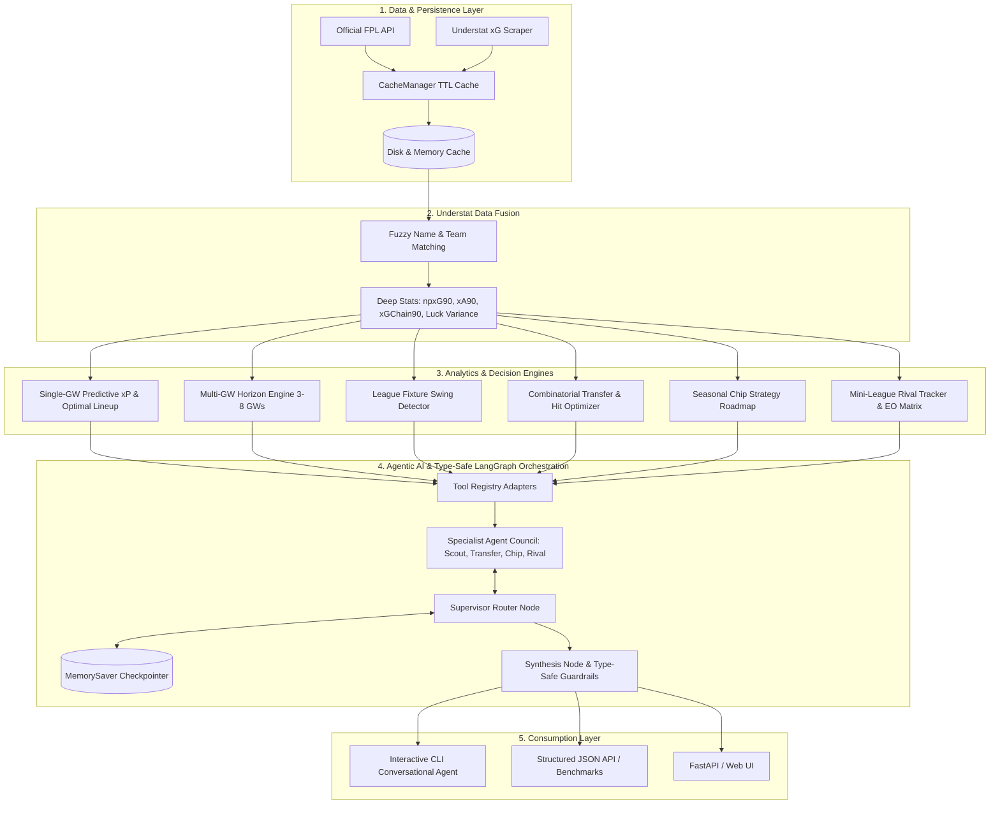

# ⚽ FPL Analyzer & Intelligence Engine

A comprehensive, modular Python analytics, optimization, and **Agentic AI** engine for **Fantasy Premier League (FPL)**. Built with deep statistical modeling, fuzzy data fusion with **Understat** (xG, xA, npxG90, xGChain90), multi-gameweek horizon forecasting, combinatorial multi-transfer optimization (1/2/3 player pair swaps), seasonal chip valuation, mini-league Effective Ownership (EO) tracking, **LangGraph multi-agent orchestration**, and **Type-Safe structured AI**.

---

## 📁 Project Architecture

```
FPl Analyzer/
├── .env.example                  # Environment variables template (Groq, Gemini, OpenAI)
├── requirements.txt              # Python package dependencies
├── pyproject.toml                # Project metadata & tooling config (UV-ready)
├── run_agent.py                  # 🚀 Interactive LangGraph CLI Conversational Agent
├── run_examples.py               # Complete runnable demo script
├── debug_api.py                  # Interactive CLI debug & benchmarking hub
├── README.md                     # Complete documentation & API reference
├── data/cache/                   # High-performance in-memory & disk TTL storage
├── debug/                        # Standalone CLI debug scripts (01-13)
│   ├── 01_bootstrap.py           # Bootstrap-static & player DataFrame
│   ├── 02_player.py              # Individual player match history & upcoming FDR
│   ├── 03_fixtures.py            # Premier League fixtures by Gameweek
│   ├── 04_manager.py             # Enriched manager squad & team listings
│   ├── 05_live.py                # Real-time live matchday points & BPS
│   ├── 06_understat.py           # Understat xG, xGChain & xGBuildup scraper
│   ├── 07_squad_analysis.py      # Single-GW predictive xP & lineup optimizer
│   ├── 08_understat_fusion.py    # Understat fuzzy name matching & per-90 metrics
│   ├── 09_multi_gw_horizon.py    # Multi-GW horizon projections & fixture swings
│   ├── 10_transfer_optimizer.py  # Combinatorial transfer & hit (-4pt) optimizer
│   ├── 11_chip_strategy.py       # Seasonal chip roadmap (WC, FH, BB, TC)
│   ├── 12_cache_benchmark.py     # Cache performance & latency benchmark
│   └── 13_league_analyzer.py     # Mini-league rival tracker & Effective Ownership (EO)
├── tests/                        # Automated Pytest unit & integration test suite
│   ├── test_agent_tools.py       # Unit tests for LangChain @tool adapters
│   └── test_agent_graph.py       # Integration tests for LangGraph multi-agent graph
└── src/
    ├── __init__.py
    ├── config.py                 # API endpoints and configuration constants
    ├── cache/                    # High-performance caching layer
    │   ├── __init__.py
    │   └── cache_manager.py      # Thread-safe in-memory & disk TTL caching
    ├── api/                      # API clients and HTTP layer
    │   ├── base_client.py        # Base HTTP client with retry logic & error handling
    │   ├── fpl_client.py         # Official FPL API client with caching
    │   └── understat_client.py   # Understat xG & shot map scraper with caching
    ├── analysis/                 # Intelligence & optimization engines
    │   ├── __init__.py
    │   ├── squad_analyzer.py     # Single-GW predictive xP & lineup optimizer
    │   ├── understat_fusion.py   # Fuzzy matching & advanced per-90 metrics fusion
    │   ├── multi_gw_analyzer.py  # Multi-GW horizon engine (3-8 GWs) & fixture swings
    │   ├── transfer_optimizer.py # Combinatorial multi-transfer & hit (-4pt) engine
    │   ├── chip_optimizer.py     # Wildcard, Free Hit, Bench Boost & TC roadmaps
    │   └── league_analyzer.py    # Mini-league rival comparison & Effective Ownership
    ├── models/                   # Pydantic schemas
    │   ├── player.py             # Player, match performance & Understat schemas
    │   ├── manager.py            # Manager profile, squad picks & team schemas
    │   └── analysis.py           # Fixture details, horizon, transfers, chips & league schemas
    └── agents/                   # 🤖 AGENTIC AI & LANGGRAPH MULTI-AGENT LAYER
        ├── __init__.py
        ├── config.py             # Multi-provider LLM factory & automatic detection (Groq, Gemini, OpenAI)
        ├── state.py              # FPLAgentState TypedDict & reducer schema
        ├── graph.py              # StateGraph assembly & MemorySaver checkpointer
        ├── tools/                # LangChain @tool adapters wrapping analysis engines
        │   ├── squad_tools.py    # Squad listings & optimal lineup tools
        │   ├── transfer_tools.py # Combinatorial transfer & -4 hit tools
        │   ├── horizon_tools.py  # Multi-GW horizon & fixture swing tools
        │   ├── chip_tools.py     # Seasonal chip roadmap tools
        │   ├── league_tools.py   # Mini-league EO & rival tracking tools
        │   └── understat_tools.py# Understat xG, xA, npxG90 & luck variance tools
        └── nodes/                # Specialist Agent Nodes
            ├── supervisor.py     # Query parser & dynamic task router
            ├── lineup_node.py    # Lineup & captaincy scoring node
            ├── scout_node.py     # Understat underlying stats scout node
            ├── transfer_node.py  # Transfer solver & hit break-even node
            ├── chip_horizon_node.py # Multi-GW horizon & chip node
            ├── rival_node.py     # Mini-league EO & rival tactician node
            └── synthesis_node.py # Final tactical coaching synthesizer
```

---

## 🚀 Key Features & Capabilities



### 1. Agentic AI & Conversational Advisor (LangGraph)
* **Supervisor-Worker Architecture:** Autonomously plans and decomposes complex manager queries into targeted sub-tasks.
* **Specialist Agent Council:** Dedicated sub-agents for Lineup Optimization, Combinatorial Transfers, Understat Scouting, Multi-GW Horizons, and Mini-League Tactics.
* **Zero Hallucinations:** Mathematical calculations, budget feasibility, and -4 hit break-evens are executed deterministically by Python tools.
* **Multi-Turn Memory:** Retains manager context, active chips, and squad state across conversations via `MemorySaver`.

### 2. Type-Safe AI & Structured Output Layer
* **Guaranteed Schemas:** Enforces strict Pydantic contracts on AI outputs, eliminating schema drift.
* **High-Speed Inference:** Cuts generation latency by 50–70% via JSON constrained decoding on Groq (`openai/gpt-oss-120b`, `qwen/qwen3.8-27b`).
* **Automated Speed & Scoring Benchmarks:** Enables programmatic scoring against historical gameweeks and latency assertions.

### 3. High-Performance TTL Caching Layer
* **Instant response times:** Sub-millisecond data retrieval on subsequent queries.
* **Disk & memory caching:** Automatic serialization in `data/cache/` with endpoint-specific TTLs.

### 4. Understat & FPL Data Fusion
* **Fuzzy name matching:** Bridges FPL elements with Understat entities across aliases and nicknames.
* **Per-90 underlying statistics:** Computes `npxG90`, `xA90`, `xGChain90`, and `xGBuildup90`.
* **Finishing variance (`xg_delta`):** Flags players who are statistically unlucky ($Goals < xG$) and "due a goal".

### 5. Multi-Gameweek Horizon Engine (3 to 8 Gameweeks)
* **Forward projections:** Evaluates rolling cumulative expected points ($\sum xP$).
* **League fixture swings:** Scans all 20 Premier League clubs for upcoming fixture swings (`Prime Target 🟢` vs `Toughening 🔴`).

### 6. Combinatorial Multi-Transfer & Point Hit Optimizer
* **1-Player, 2-Player, & 3-Player Swaps:** Evaluates simultaneous pair transfers.
* **Point Hit ($-4/-8$) Break-Even:** Computes whether taking a transfer hit yields a net positive payoff over the multi-GW horizon.

### 7. Mini-League Rival Tracker & Effective Ownership (EO)
* **Effective Ownership (EO) Engine:** Calculates accurate league-wide Effective Ownership ($Starting \% + Captain \% + 2 \times TC \%$).
* **Head-to-head overlap:** Analyzes shared players and captain clashes vs mini-league rivals.

---

## 🤖 Interactive Conversational Agent (`run_agent.py`)

Launch the conversational terminal agent:

```powershell
uv run python run_agent.py
```

```
===========================================================================
⚽  FPL INTELLIGENCE ENGINE — AGENTIC AI ADVISOR (LangGraph)
===========================================================================
🤖  Active LLM Engine : Groq (openai/gpt-oss-120b) 🚀
---------------------------------------------------------------------------
Commands:
  • Type your question naturally (e.g. 'What transfers should I make for GW6?')
  • /manager <id>  : Set default manager ID (e.g. /manager 1209336)
  • /league <id>   : Set default mini-league ID (e.g. /league 314)
  • /reset         : Clear conversation memory
  • /exit or /quit : Exit
===========================================================================
```

### Example Questions to Ask:
* *"What is the best starting XI and captain for Manager 1209336?"*
* *"Should I take a -4 hit to bring in Salah for GW6?"*
* *"Who are the top underperforming players on Understat due a goal?"*
* *"Analyze my mini-league (ID: 314) and suggest differentials to catch the leader."*
* *"When should I play my Wildcard or Free Hit over the next 5 gameweeks?"*

---

## ⚙️ Configuration & Environment Setup

Copy `.env.example` to `.env`:

```powershell
cp .env.example .env
```

### LLM Provider Setup (Free Tier Supported 100%):

```env
# Default Manager & Mini-League IDs
DEFAULT_MANAGER_ID=1209336
DEFAULT_LEAGUE_ID=314

# Option 1: Groq (Ultra-Fast Free Tier - Recommended)
GROQ_API_KEY=gsk_your_groq_api_key_here
FPL_AGENT_MODEL=openai/gpt-oss-120b

# Option 2: Google Gemini (Free Tier Supported)
GEMINI_API_KEY=your_gemini_api_key_here
FPL_AGENT_MODEL=gemini-2.0-flash

# Option 3: OpenAI
OPENAI_API_KEY=your_openai_api_key_here
FPL_AGENT_MODEL=gpt-4o-mini
```

> [!NOTE]
> If no API key is provided, the agent automatically runs in **Offline Deterministic Mode**, executing full Python calculations and generating structured reports without crashing.

---

## 🛠️ Installation & Testing

### 1. Install Dependencies with UV
```powershell
uv sync
# Or using pip:
pip install -r requirements.txt
```

### 2. Run Automated Test Suite
```powershell
uv run pytest
```

---

## 🗺️ Roadmap & Project Status

- [x] **Step 1:** High-Performance TTL In-Memory & Disk Caching Layer ([`CacheManager`](file:///d:/Project/FPl%20Analyzer/src/cache/cache_manager.py))
- [x] **Step 2:** Understat & FPL Data Fusion ([`UnderstatFusion`](file:///d:/Project/FPl%20Analyzer/src/analysis/understat_fusion.py))
- [x] **Step 3:** Multi-Gameweek Horizon Engine & Fixture Swings ([`MultiGWAnalyzer`](file:///d:/Project/FPl%20Analyzer/src/analysis/multi_gw_analyzer.py))
- [x] **Step 4:** Combinatorial Multi-Transfer & Chip Strategy Engine ([`TransferOptimizer`](file:///d:/Project/FPl%20Analyzer/src/analysis/transfer_optimizer.py), [`ChipOptimizer`](file:///d:/Project/FPl%20Analyzer/src/analysis/chip_optimizer.py))
- [x] **Step 5:** Mini-League Rival Tracker & Effective Ownership (EO) Engine ([`LeagueAnalyzer`](file:///d:/Project/FPl%20Analyzer/src/analysis/league_analyzer.py))
- [x] **Step 6:** Agentic AI Layer & LangGraph Multi-Agent Orchestrator ([`src/agents/`](file:///d:/Project/FPl%20Analyzer/src/agents), [`run_agent.py`](file:///d:/Project/FPl%20Analyzer/run_agent.py))
- [x] **Step 7:** Automatic Multi-Provider LLM Detection (Groq, Gemini, OpenAI, Offline Fallback)
- [ ] **Step 8:** Interactive Web UI (FastAPI backend + Streamlit/Next.js Frontend)
