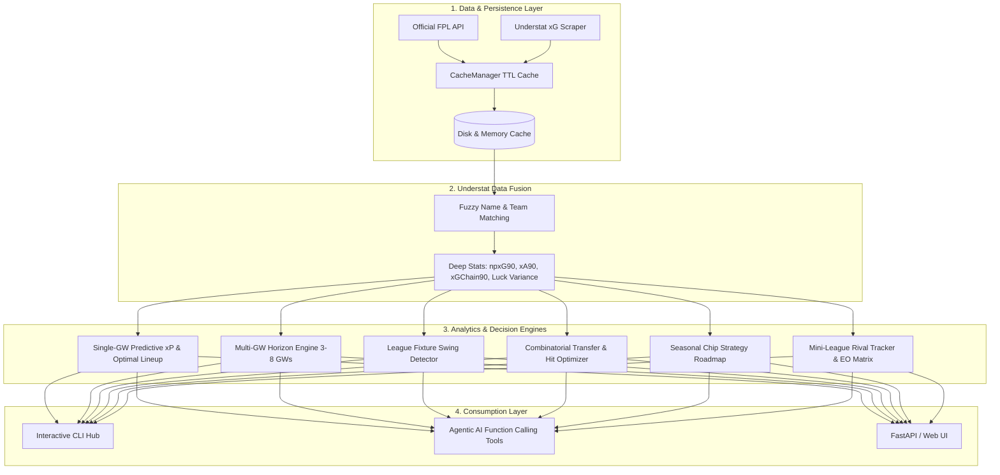

# ⚽ FPL Analyzer & Intelligence Engine

A comprehensive, modular Python analytics and optimization engine for **Fantasy Premier League (FPL)**. Built with deep statistical modeling, fuzzy data fusion with **Understat** (xG, xA, npxG90, xGChain90), multi-gameweek horizon forecasting, combinatorial multi-transfer optimization (1/2/3 player pair swaps), seasonal chip valuation, mini-league Effective Ownership (EO) tracking, and high-speed TTL caching.

---

## 📁 Project Architecture

```
FPl Analyzer/
├── .env.example                  # Environment variables template
├── requirements.txt              # Python package dependencies
├── pyproject.toml                # Project metadata & tooling config
├── run_examples.py               # Complete runnable demo script
├── debug_api.py                  # Interactive CLI debug & benchmarking hub
├── README.md                     # Complete documentation & API reference
├── data/cache/                   # High-performance in-memory & disk TTL storage
├── debug/                        # Standalone CLI debug scripts (01-13)
│   ├── 01_bootstrap.py           # Bootstrap-static & player DataFrame
│   ├── 02_player.py              # Individual player match history & upcoming FDR
│   ├── 03_fixtures.py            # Premier League fixtures by Gameweek
│   ├── 04_manager.py             # Enriched manager squad & team listings
│   ├── 05_live.py                # Real-time live matchday points & BPS
│   ├── 06_understat.py           # Understat xG, xGChain & xGBuildup scraper
│   ├── 07_squad_analysis.py      # Single-GW predictive xP & lineup optimizer
│   ├── 08_understat_fusion.py    # Understat fuzzy name matching & per-90 metrics
│   ├── 09_multi_gw_horizon.py    # Multi-GW horizon projections & fixture swings
│   ├── 10_transfer_optimizer.py  # Combinatorial transfer & hit (-4pt) optimizer
│   ├── 11_chip_strategy.py       # Seasonal chip roadmap (WC, FH, BB, TC)
│   ├── 12_cache_benchmark.py     # Cache performance & latency benchmark
│   └── 13_league_analyzer.py     # Mini-league rival tracker & Effective Ownership (EO)
└── src/
    ├── __init__.py
    ├── config.py                 # API endpoints and configuration constants
    ├── cache/                    # High-performance caching layer
    │   ├── __init__.py
    │   └── cache_manager.py      # Thread-safe in-memory & disk TTL caching
    ├── api/                      # API clients and HTTP layer
    │   ├── base_client.py        # Base HTTP client with retry logic & error handling
    │   ├── fpl_client.py         # Official FPL API client with caching
    │   └── understat_client.py   # Understat xG & shot map scraper with caching
    ├── analysis/                 # Intelligence & optimization engines
    │   ├── __init__.py
    │   ├── squad_analyzer.py     # Single-GW predictive xP & lineup optimizer
    │   ├── understat_fusion.py   # Fuzzy matching & advanced per-90 metrics fusion
    │   ├── multi_gw_analyzer.py  # Multi-GW horizon engine (3-8 GWs) & fixture swings
    │   ├── transfer_optimizer.py # Combinatorial multi-transfer & hit (-4pt) engine
    │   ├── chip_optimizer.py     # Wildcard, Free Hit, Bench Boost & TC roadmaps
    │   └── league_analyzer.py    # Mini-league rival comparison & Effective Ownership
    └── models/                   # Pydantic schemas
        ├── player.py             # Player, match performance & Understat schemas
        ├── manager.py            # Manager profile, squad picks & team schemas
        └── analysis.py           # Fixture details, horizon, transfers, chips & league schemas
```

---

## 🚀 Key Features & Capabilities



### 1. High-Performance TTL Caching Layer
* **Instant response times:** Sub-millisecond data retrieval on subsequent queries.
* **Disk & memory caching:** Automatic serialization in `data/cache/` with endpoint-specific TTLs (1 hour for bootstrap, 24 hours for fixtures, 60s for live matches).
* **Rate-limit prevention:** Safeguards your IP against FPL request throttling.

### 2. Understat & FPL Data Fusion
* **Fuzzy name matching:** Accurately bridges FPL elements with Understat entities across aliases, nicknames, and diacritics (e.g. *Haaland, Saka, Son, Gabriel, Darwin Núñez, Bruno Fernandes*).
* **Per-90 underlying statistics:** Computes non-penalty expected goals (`npxG90`), expected assists (`xA90`), total possession threat (`xGChain90`), and deep buildup (`xGBuildup90`).
* **Finishing variance (`xg_delta`):** Flags players who are statistically unlucky ($Goals < xG$) and "due a goal".

### 3. Multi-Gameweek Horizon Engine (3 to 8 Gameweeks)
* **Forward projections:** Evaluates rolling cumulative expected points ($\sum xP$) across a multi-week planning window.
* **League fixture swings:** Scans all 20 Premier League clubs to identify positive fixture swings (`Prime Target 🟢`) and hardening schedules (`Toughening 🔴`).
* **GW-by-GW lineup planning:** Projects optimal Starting XI and captaincy choices for every future gameweek in the window.

### 4. Combinatorial Multi-Transfer & Point Hit Optimizer
* **1-Player, 2-Player, & 3-Player Swaps:** Evaluates simultaneous pair transfers (e.g. downgrading a defender to upgrade a midfielder to Salah).
* **Banked Free Transfers (1–5 FTs):** Simulates strategy with accumulated Free Transfers under the latest FPL rules.
* **Point Hit ($-4/-8$) Break-Even:** Computes whether taking a transfer hit yields a net positive payoff over the multi-GW horizon.

### 5. Seasonal Chip Strategy & Valuation
* **Automated roadmaps:** Evaluates remaining chips (**Wildcard**, **Free Hit**, **Bench Boost**, **Triple Captain**).
* **Anomaly detection:** Identifies Double Gameweeks (DGW) and Blank Gameweeks (BGW) to schedule the highest-upside execution windows.

### 6. Mini-League Rival Tracker & Effective Ownership (EO)
* **Effective Ownership (EO) Engine:** Calculates accurate league-wide Effective Ownership ($Starting \% + Captain \% + 2 \times TC \%$).
* **Head-to-head overlap:** Analyzes shared players (e.g. 9/11 starters) and captain clashes vs mini-league rivals and the league leader.
* **Differential detector:** Uncovers high-$xP$ players owned by $<20\%$ of your mini-league rivals to maximize rank climbing.

---

## 🛠️ Installation & Setup

### 1. Install Dependencies
Make sure you have Python 3.10+ installed. In your terminal, run:
```powershell
pip install -r requirements.txt
```
*Or using UV:*
```powershell
uv pip install -r requirements.txt
```

### 2. Configure Environment (Optional)
Copy `.env.example` to `.env` to configure default manager and authentication cookies:
```powershell
cp .env.example .env
```
Key variables:
- `DEFAULT_MANAGER_ID`: Your FPL Manager ID (e.g. `1209336`).
- `DEFAULT_LEAGUE_ID`: Your Mini-League ID (e.g. `314`).
- `FPL_COOKIE`: Your `pl_profile` browser cookie (optional, unlocks private pre-deadline `/my-team/` syncing).

---

## 💻 Code Examples & API Usage

### 1. Mini-League & Effective Ownership (EO) Analysis
```python
from src.api.fpl_client import FPLClient

client = FPLClient()

# Analyze a Mini-League with head-to-head comparisons against your squad
league_report = client.analyze_mini_league(league_id=314, target_manager_id=1209336)

print(f"League: {league_report.league_name} ({league_report.total_managers} Managers)")

# Top Effective Ownership (EO) in this Mini-League
for eo in league_report.effective_ownership[:5]:
    print(f"• {eo.web_name:<16} ({eo.team_short_name}) : EO {eo.effective_ownership_pct:>5.1f}% | {eo.threat_sentiment}")

# Head-to-Head Overlap with Rivals
for rival in league_report.rival_comparisons[:3]:
    print(f"\nVs #{rival.rival_rank} {rival.rival_name}: Shared {rival.shared_players_count}/15 ({rival.overlap_percentage}%) | Captain: {rival.rival_captain}")
    print(f"  Your Differentials: {', '.join(rival.user_differentials)}")
```

---

### 2. Multi-Gameweek Horizon Projections (Next 5 Gameweeks)
```python
# Project Next 5 Gameweeks for a Manager
horizon_report = client.analyze_manager_horizon(manager_id=1209336, horizon_length=5)

print(f"Manager: {horizon_report.manager_name} | Team: {horizon_report.team_name}")
print(f"Total Horizon Projected xP: {horizon_report.total_horizon_xp:.1f} pts (Avg: {horizon_report.avg_xp_per_gw:.1f} pts/GW)\n")

# Gameweek-by-Gameweek Lineups & Captains
for gw_proj in horizon_report.gameweek_squads:
    cap = gw_proj.captain.player
    print(f"• GW {gw_proj.gameweek}: Formation {gw_proj.formation} | Captain: {cap.web_name} ({gw_proj.captain.expected_points:.1f} xP) | GW Total: {gw_proj.projected_xp:.1f} xP")

# League-Wide Fixture Swings
print("\nTop Upcoming Fixture Swings:")
for swing in horizon_report.fixture_swings[:3]:
    print(f"  🟢 {swing.team_name} (Avg FDR: {swing.fdr_avg:.2f}) -> {swing.sentiment} | Key Targets: {', '.join(swing.key_assets)}")
```

---

### 3. Combinatorial Transfer Optimization (1 & 2 Player Swaps)
```python
# Optimize transfers over a 4-week horizon with 1 Free Transfer
transfer_report = client.optimize_transfers(
    manager_id=1209336, 
    horizon_length=4, 
    free_transfers=1
)

print(f"Available Bank: £{transfer_report.current_bank_m:.1f}m | Free Transfers: {transfer_report.available_free_transfers}")

if transfer_report.best_overall_recommendation:
    best = transfer_report.best_overall_recommendation
    print(f"\n👑 Top Strategic Recommendation:")
    print(f"   {best.rationale}")
    print(f"   Net Horizon Gain: +{best.net_horizon_gain:.2f} xP (Breaks even by GW {best.break_even_gw})")
```

---

### 4. Seasonal Chip Strategy Roadmap
```python
# Evaluate seasonal chip timing
chip_roadmap = client.evaluate_chips(manager_id=1209336)

print(f"Remaining Chips: {', '.join(c.upper() for c in chip_roadmap.chips_remaining)}")
for rec in chip_roadmap.recommendations:
    print(f"• {rec.chip_name.upper():<14} -> Recommended Target: GW {rec.recommended_gw} (+{rec.projected_upside_xp:.1f} xP upside)")
    print(f"  Reason: {rec.trigger_reason}\n")
```

---

### 5. Understat Deep Metrics & Fuzzy Name Matching
```python
from src.api.understat_client import UnderstatClient
from src.analysis.understat_fusion import UnderstatFusion

understat = UnderstatClient()
u_players = understat.get_league_players()

fusion = UnderstatFusion(u_players)

# Lookup deep underlying stats for any player
haaland = fusion.match_player(web_name="Haaland", first_name="Erling", second_name="Haaland", team_name="Man City")
if haaland:
    print(f"Player: {haaland.player_name} ({haaland.team_title})")
    print(f"npxG90: {haaland.npxG90} | xA90: {haaland.xA90} | xGChain90: {haaland.xGChain90}")
    print(f"Finishing Luck (xG Delta): {haaland.xg_delta:+0.2f}")
```

---

### 6. Single-Gameweek Squad Analysis, Captaincy & Auto-Subs
```python
report = client.analyze_manager_squad(manager_id=1209336)
opt = report.optimization

print(f"Target GW: {report.target_gameweek} | Recommended Formation: {opt.formation} ({opt.total_projected_xp:.1f} xP)")

# Top 3 Captaincy Hierarchy
print("\nCaptaincy Hierarchy:")
for c in opt.captain_hierarchy:
    print(f"  #{c.rank} {c.role_name}: {c.player.web_name} ({c.expected_points:.2f} xP) - {c.rationale}")

# Formatted Squad DataFrame
df = client.get_squad_analysis_df(manager_id=1209336)
print(df[["Player", "Team", "Pos", "Opponent (FDR)", "Form", "xP", "Score (0-100)", "Recommended Role"]].head(11))
```

---

## 🕹️ CLI Debugging & Benchmarking Hub

The project includes standalone debug scripts for every feature and a unified interactive CLI hub ([`debug_api.py`](file:///d:/Project/FPl%20Analyzer/debug_api.py)):

### Standalone Debug Scripts

| Script | Purpose | CLI Command |
| :--- | :--- | :--- |
| **`01_bootstrap.py`** | Official FPL players, teams, and Gameweek deadlines | `python debug/01_bootstrap.py` |
| **`02_player.py`** | Detailed match-by-match history and upcoming FDR | `python debug/02_player.py [player_id]` |
| **`03_fixtures.py`** | Premier League fixtures and difficulty ratings | `python debug/03_fixtures.py [gameweek]` |
| **`04_manager.py`** | Enriched manager squad picks, bank, and team listing | `python debug/04_manager.py [manager_id] [gw]` |
| **`05_live.py`** | Real-time live matchday points, bonus points & BPS | `python debug/05_live.py [gameweek]` |
| **`06_understat.py`** | Scrapes Understat xG, xGChain, and match shot maps | `python debug/06_understat.py` |
| **`07_squad_analysis.py`** | Single-GW Starting XI, captaincy, and bench auto-subs | `python debug/07_squad_analysis.py [manager_id] [gw]` |
| **`08_understat_fusion.py`** | Tests fuzzy name matching and per-90 metrics fusion | `python debug/08_understat_fusion.py` |
| **`09_multi_gw_horizon.py`** | Multi-GW horizon projections (3-8 GWs) & fixture swings | `python debug/09_multi_gw_horizon.py [manager_id] [horizon]` |
| **`10_transfer_optimizer.py`** | Combinatorial 1/2/3 transfer optimizer & point hit break-even | `python debug/10_transfer_optimizer.py [manager_id] [ft]` |
| **`11_chip_strategy.py`** | Seasonal chip strategy roadmap (WC, FH, BB, TC) | `python debug/11_chip_strategy.py [manager_id]` |
| **`12_cache_benchmark.py`** | Cache performance benchmark (Cold network vs Warm cache) | `python debug/12_cache_benchmark.py` |
| **`13_league_analyzer.py`** | Mini-league rival tracker & Effective Ownership (EO) | `python debug/13_league_analyzer.py [league_id] [manager_id]` |

### Unified Interactive Hub ([`debug_api.py`](file:///d:/Project/FPl%20Analyzer/debug_api.py))

```powershell
# Launch interactive menu
python debug_api.py

# Or pass direct CLI flags
python debug_api.py league 314 --mid 1209336
python debug_api.py horizon 1209336 --horizon 5
python debug_api.py transfers 1209336 --ft 2 --horizon 4
python debug_api.py chips 1209336
python debug_api.py fusion
python debug_api.py cache
python debug_api.py ping-all
```

---

## 🔒 Pre-Deadline Privacy & Forward Projection

### Why aren't upcoming Gameweek picks visible on the public API immediately?
In official FPL:
- The public API (`/api/entry/{manager_id}/event/{gw}/picks/`) **locks and hides** all pre-deadline transfers and captaincy choices until that Gameweek's deadline officially expires.
- This prevents rival mini-league managers from scouting and copying your pre-deadline moves.

### How the Engine Handles This:
1. **Automatic Forward-Projection (Default):** The engine automatically loads your latest confirmed squad (e.g. GW 5) and evaluates it against future fixtures (GW 6, 7, 8).
2. **Transfer Simulation / Manual Overrides:** Pass `transfers_out=[355]` and `transfers_in=[19]` to test prospective moves on the fly.
3. **Authenticated Live Sync:** Provide `FPL_COOKIE` in `.env` to query your private `/api/my-team/{manager_id}/` endpoint for saved pre-deadline transfers and live bank balances.

---

## 🗺️ Completed Roadmap & Next Steps

- [x] **Step 1:** High-Performance TTL In-Memory & Disk Caching Layer ([`CacheManager`](file:///d:/Project/FPl%20Analyzer/src/cache/cache_manager.py))
- [x] **Step 2:** Understat & FPL Data Fusion ([`UnderstatFusion`](file:///d:/Project/FPl%20Analyzer/src/analysis/understat_fusion.py))
- [x] **Step 3:** Multi-Gameweek Horizon Engine & Fixture Swings ([`MultiGWAnalyzer`](file:///d:/Project/FPl%20Analyzer/src/analysis/multi_gw_analyzer.py))
- [x] **Step 4:** Combinatorial Multi-Transfer & Chip Strategy Engine ([`TransferOptimizer`](file:///d:/Project/FPl%20Analyzer/src/analysis/transfer_optimizer.py), [`ChipOptimizer`](file:///d:/Project/FPl%20Analyzer/src/analysis/chip_optimizer.py))
- [x] **Step 5:** Mini-League Rival Tracker & Effective Ownership (EO) Engine ([`LeagueAnalyzer`](file:///d:/Project/FPl%20Analyzer/src/analysis/league_analyzer.py))
- [ ] **Step 6:** Agentic AI Tool Registry (LLM Function Calling API & ReAct reasoning)
- [ ] **Step 7:** Interactive Web UI (FastAPI backend + Modern Frontend)
