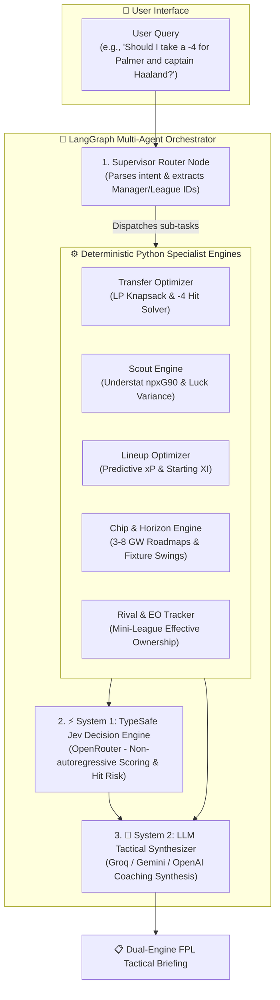
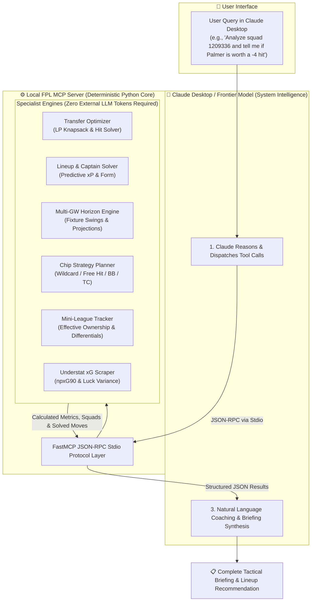

# ⚽ FPL Intelligence Engine & Agentic Dual-Core AI

[](https://www.python.org/downloads/)
[](https://github.com/langchain-ai/langgraph)
[](https://openrouter.ai/)
[](tests/)
[](LICENSE)

A high-performance analytics, optimization, and **Hybrid Agentic AI Engine** for **Fantasy Premier League (FPL)**. 

Powered by a **System 1 / System 2 dual-core architecture**:
* **⚡ System 1 (TypeSafe Jev via OpenRouter)**: High-speed structured decision scoring, hit-risk evaluation, and calibrated confidence estimation.
* **🧠 System 2 (Groq / Gemini / OpenAI)**: Deep conversational synthesis, natural language tactical coaching, and long-term horizon roadmaps.
* **⚙️ Deterministic Solvers**: Combinatorial transfer optimizers (1/2/3 player swaps), -4 hit break-even calculators, Understat xG/xA fuzzy data fusion, and mini-league Effective Ownership (EO) tracking.

---

## 🏛️ System Architecture


```mermaid
flowchart TD
    subgraph User["👤 User Interface"]
        UQ["User Query\n(e.g., 'Should I take a -4 for Palmer and captain Haaland?')"]
    end

    subgraph Orchestration["🤖 LangGraph Multi-Agent Orchestrator"]
        Sup["1. Supervisor Router Node\n(Parses intent & extracts Manager/League IDs)"]
        
        subgraph Solvers["⚙️ Deterministic Python Specialist Engines"]
            T_NODE["Transfer Optimizer\n(LP Knapsack & -4 Hit Solver)"]
            S_NODE["Scout Engine\n(Understat npxG90 & Luck Variance)"]
            L_NODE["Lineup Optimizer\n(Predictive xP & Starting XI)"]
            C_NODE["Chip & Horizon Engine\n(3-8 GW Roadmaps & Fixture Swings)"]
            R_NODE["Rival & EO Tracker\n(Mini-League Effective Ownership)"]
        end

        JEV["2. ⚡ System 1: TypeSafe Jev Decision Engine\n(OpenRouter - Non-autoregressive Scoring & Hit Risk)"]
        SYNTH["3. 🧠 System 2: LLM Tactical Synthesizer\n(Groq / Gemini / OpenAI Coaching Synthesis)"]
    end

    UQ --> Sup
    Sup -->|Dispatches sub-tasks| Solvers
    Solvers --> JEV
    JEV --> SYNTH
    Solvers --> SYNTH
    SYNTH --> FinalOutput["📋 Dual-Engine FPL Tactical Briefing"]
```

---

## 🌟 Key Capabilities & Features

### 1. ⚡ Hybrid Dual-Engine AI (System 1 + System 2)
* **Instant Decision Verdicts**: Emits structured verdicts, urgency scores, and hit-risk levels.
* **Calibrated Confidence**: Machine-rated confidence percentage on every transfer and captaincy call.
* **Graceful Degradation & Zero SPOF**: If the Jev API is unreachable, the system automatically flags `⚠️ Jev: Not Available` and seamlessly falls back to exact deterministic mathematical formulas without crashing.

### 2. 🔍 Understat & Advanced Statistics Fusion
* **Fuzzy Name Resolution**: Bridges official FPL player identities with Understat entities across nicknames and spelling variations.
* **Per-90 Metrics**: Calculates `npxG90`, `xA90`, `xGChain90`, and `xGBuildup90`.
* **Luck Variance ($\Delta\text{xG}$)**: Identifies underperforming players due for a statistical rebound ($Goals < xG$).

### 3. 🔄 Combinatorial Multi-Transfer & Point-Hit (-4) Solver
* **Pair & Triple Swaps**: Analyzes complex multi-player combinations to find maximum net expected point ($\Delta\text{xP}$) uplift.
* **Break-Even Horizon**: Computes the exact future gameweek by which a point deduction ($-4 / -8$) turns net-positive.

### 4. 🗓️ Multi-Gameweek Horizon Projections (3 to 8 GWs)
* **Rolling Projections**: Aggregates projected cumulative points ($\sum xP$) over customizable fixture horizons.
* **Fixture Swing Detection**: Flags teams entering favorable green runs (`Prime Target 🟢`) versus tough schedules (`Toughening 🔴`).

### 5. 🏆 Mini-League Rival Tracker & Effective Ownership (EO)
* **Accurate EO Calculations**: Computes league-wide Effective Ownership ($Starting \% + Captain \% + 2 \times TC \%$).
* **Differential Hunting**: Recommends low-ownership assets to overtake mini-league leaders.

---

## 📂 Project Structure

```
FPl Analyzer/
├── .env.example                  # Environment configuration template
├── requirements.txt              # Standard pip dependencies
├── pyproject.toml                # UV package definition & tool configuration
├── run_agent.py                  # 🚀 Interactive CLI conversational agent
├── debug_api.py                  # Interactive CLI debug & benchmarking hub
├── data/cache/                   # In-memory & disk TTL cache directory
├── debug/                        # Modular component debug runners
│   ├── 01_bootstrap.py           # FPL static bootstrap data inspector
│   ├── 04_manager.py             # Manager squad & team loader
│   ├── 06_understat.py           # Understat scraper & per-90 metrics
│   ├── 08_understat_fusion.py    # Fuzzy player matching verification
│   ├── 10_transfer_optimizer.py  # Combinatorial transfer solver demo
│   └── 14_jev_agent_debug.py     # ⚡ Live Jev & Agent execution debug console
├── tests/                        # Automated Pytest suite (16 tests)
│   ├── test_agent_graph.py       # LangGraph routing & state preservation
│   ├── test_agent_tools.py       # Specialist engine tool adapters
│   └── test_jev_integration.py   # Jev scoring, fallbacks & response formatting
└── src/
    ├── api/                      # FPL & Understat HTTP clients with retry & rate limiting
    ├── cache/                    # Thread-safe TTL memory & disk caching
    ├── analysis/                 # Analytical, LP optimization & statistical fusion engines
    ├── models/                   # Pydantic data schemas
    └── agents/                   # 🤖 LangGraph Multi-Agent Engine
        ├── config.py             # Multi-provider client factories (Groq, OpenRouter, Gemini)
        ├── state.py              # FPLAgentState schema with Jev decision context
        ├── graph.py              # Compiled StateGraph with checkpointer
        ├── tools/                # LangChain @tool wrappers
        └── nodes/                # Agent nodes (Supervisor, Scorer, Workers, Synthesis)
```

---

## 🚀 Quickstart & Installation

### 1. Clone & Install Dependencies

Using [**uv**](https://github.com/astral-sh/uv) *(recommended)*:
```powershell
uv sync
```

Or standard **pip**:
```powershell
pip install -r requirements.txt
```

---

### 2. Configure Environment Variables

Copy `.env.example` to `.env`:
```powershell
cp .env.example .env
```

Set your API keys:
```env
# Default Manager and Mini-League IDs
DEFAULT_MANAGER_ID=
DEFAULT_LEAGUE_ID=

# 1. System 1: TypeSafe Jev (via OpenRouter)
OPENROUTER_API_KEY=sk-or-v1-your_openrouter_api_key_here
JEV_MODEL=meta-llama/llama-3.2-3b-instruct

# 2. System 2: Conversational Synthesis (via Groq / Gemini / OpenAI)
GROQ_API_KEY=gsk_your_groq_api_key_here
FPL_AGENT_MODEL=openai/gpt-oss-120b
```

> [!NOTE]
> If no API keys are provided, the agent runs in **Offline Deterministic Mode**, executing full Python optimization solvers and outputting structured reports.

---

### 3. Launch the Conversational Agent

```powershell
uv run python run_agent.py
```

```text
===========================================================================
⚽  FPL INTELLIGENCE ENGINE — AGENTIC AI ADVISOR (LangGraph)
===========================================================================
🤖  Active LLM Engine : Groq (openai/gpt-oss-120b) 🚀
⚡  Jev Engine Status : 🟢 Online (meta-llama/llama-3.2-3b-instruct)
---------------------------------------------------------------------------
Commands:
  • Ask anything (e.g. 'Should I take a -4 hit to buy Palmer for GW6?')
  • /manager <id>  : Set default manager ID
  • /league <id>   : Set default mini-league ID
  • /reset         : Reset conversation memory
  • /exit or /quit : Exit
===========================================================================
```

---

## 💻 Sample Output Preview

```markdown
## ⚡ TypeSafe Jev Fast Decision Engine
- **Verdict**: BUY Cole Palmer for Bukayo Saka
- **Hit Risk Assessment**: Medium
- **Transfer Urgency**: High (85%)
- **Recommendation Confidence**: 92.1%
- **Key Metric**: +3.2 net xP gain over 3 GW horizon
- **Status**: 🟢 Online (1442ms)

---

## 🧠 Tactical Coach Advisory

## 🏆 Recommended Lineup & Captaincy
- **Captain (C):** Erling Haaland (Home vs. Everton) — 0.85 npxG90.
- **Vice-Captain (VC):** Mohamed Salah (Home vs. Wolves).

## 🔄 Transfer Moves & -4 Hit Justification
| Move | Out → In | Net xP Δ | Bank | Hit Cost | Break-Even GW |
| :--- | :--- | :--- | :--- | :--- | :--- |
| **Option 1** | Saka → **Palmer** | **+25.9** | £0.0m | -4 pts | **GW 6** |
| **Option 2** | Greaves → **Davis** | **+25.9** | £0.0m | 0 pts | Immediate |

### Strategic Recommendation
Take the -4 hit for Palmer only if chasing rank differential. Otherwise, execute Greaves → Davis for an identical point uplift without penalty.
```

---

## 🧪 Testing & Verification

Run the full automated test suite (16 tests):

```powershell
uv run pytest -v
```

Run the live dual-engine debug console:

```powershell
uv run python debug/14_jev_agent_debug.py
```

---

## 🔌 Model Context Protocol (MCP) Server (Claude Desktop & AI Tools)

This repository includes a native **Model Context Protocol (MCP) Server** ([`mcp_server.py`](file:///d:/Project/FPl%20Analyzer/mcp_server.py)). MCP is an open standard that allows frontier AI assistants (**Claude Desktop**, **Claude Code**, **Antigravity**, **Cursor**, **Windsurf**) to execute your local Python functions securely and deterministically.

---

### 🏛️ MCP Architecture: How It Works


```mermaid
flowchart TD
    subgraph User["👤 User Interface"]
        Prompt["User Query in Claude Desktop\n(e.g., 'Analyze squad 1209336 and tell me if Palmer is worth a -4 hit')"]
    end

    subgraph LLM["🧠 Claude Desktop / Frontier Model (System Intelligence)"]
        Planner["1. Claude Reasons & Dispatches Tool Calls"]
        Synthesizer["3. Natural Language Coaching & Briefing Synthesis"]
    end

    subgraph LocalMCP["⚙️ Local FPL MCP Server (Deterministic Python Core)"]
        FastMCP["FastMCP JSON-RPC Stdio Protocol Layer"]
        
        subgraph Engines["Specialist Engines (Zero External LLM Tokens Required)"]
            T_OPT["Transfer Optimizer\n(LP Knapsack & Hit Solver)"]
            L_OPT["Lineup & Captain Solver\n(Predictive xP & Form)"]
            H_OPT["Multi-GW Horizon Engine\n(Fixture Swings & Projections)"]
            C_OPT["Chip Strategy Planner\n(Wildcard / Free Hit / BB / TC)"]
            R_OPT["Mini-League Tracker\n(Effective Ownership & Differentials)"]
            U_OPT["Understat xG Scraper\n(npxG90 & Luck Variance)"]
        end
    end

    Prompt --> Planner
    Planner -->|JSON-RPC via Stdio| FastMCP
    FastMCP --> Engines
    Engines -->|Calculated Metrics, Squads & Solved Moves| FastMCP
    FastMCP -->|Structured JSON Results| Synthesizer
    Synthesizer --> Briefing["📋 Complete Tactical Briefing & Lineup Recommendation"]
```

#### 🔑 Key Differences: CLI Mode vs. Claude MCP Mode

| Dimension | CLI Interactive Mode (`run_agent.py`) | Claude MCP Mode (`mcp_server.py`) |
| :--- | :--- | :--- |
| **LLM Engine** | Groq / Gemini / OpenRouter Jev | **Claude Desktop (Sonnet 3.7 / Opus)** |
| **API Keys Needed** | ✅ Required in `.env` (`GROQ_API_KEY`, etc.) | ❌ **None required** for the server (uses Claude directly) |
| **Math & Optimization** | Python Deterministic Solvers | Python Deterministic Solvers |
| **Protocol** | LangGraph StateGraph Execution | Standard Model Context Protocol (stdio) |
| **Best For** | Standalone terminal use & scripting | Interactive UI with Claude Desktop, Artifacts & IDEs |

---

### 🚀 How to Use the MCP Server

#### 🌟 Method 1: Zero-Install via GitHub *(For Any User / No Cloning Required)*

If you (or another manager) have [`uv`](https://github.com/astral-sh/uv) installed, you can launch the MCP server directly from GitHub without cloning the repo or managing virtual environments.

1. Open your Claude Desktop configuration file:
   * **Windows**: `%APPDATA%\Claude\claude_desktop_config.json`
   * **macOS**: `~/Library/Application Support/Claude/claude_desktop_config.json`

2. Add the `fpl-analyzer` server entry:

```json
{
  "mcpServers": {
    "fpl-analyzer": {
      "command": "uv",
      "args": [
        "run",
        "--with",
        "git+https://github.com/Salif123/LEO_FPL.git",
        "python",
        "-m",
        "mcp_server"
      ]
    }
  }
}
```

---

#### 💻 Method 2: Local Repository Setup *(For Development)*

If you cloned this repository locally:

1. **Install dependencies**:
   ```powershell
   uv sync
   ```

2. **Add local path to Claude Desktop configuration**:
   ```json
   {
     "mcpServers": {
       "fpl-analyzer": {
         "command": "uv",
         "args": [
           "--directory",
           "D:\\Project\\FPl Analyzer",
           "run",
           "python",
           "mcp_server.py"
         ]
       }
     }
   }
   ```

3. **(Optional) Inspect & Test with MCP Inspector**:
   ```powershell
   npx @modelcontextprotocol/inspector uv run python mcp_server.py
   ```

---

### 🛠️ Available MCP Tools Reference

The server exposes 8 specialist deterministic tools directly to Claude:

| Tool Name | Parameters | Description | Output Data |
| :--- | :--- | :--- | :--- |
| `get_squad` | `manager_id: int`<br>`gameweek: Optional[int]` | Fetches live squad info, starting XI, bench, bank balance, and selling values. | Team value, bank, starting XI, bench order, player fitness/news. |
| `get_optimal_lineup` | `manager_id: int`<br>`gameweek: Optional[int]` | Solves optimal Starting XI, formation (e.g., 3-4-3), Captain (C), and VC. | Optimal formation, total xP, Captain & VC picks, ordered substitutions. |
| `optimize_transfers` | `manager_id: int`<br>`free_transfers: int`<br>`horizon_length: int`<br>`max_transfers: int` | Evaluates combinatorial 1/2/3 player transfers with -4 hit break-even analysis. | Ranked transfer combinations, net xP uplift, cost feasibility, break-even GW. |
| `get_horizon_projections`| `manager_id: int`<br>`horizon_length: int` | Projects forward squad performance over 3–8 GWs and flags fixture swings. | Cumulative xP, gameweek captain roadmap, club fixture difficulty swings. |
| `evaluate_chips` | `manager_id: int` | Computes optimal windows for Wildcard, Free Hit, Bench Boost, and Triple Captain. | Chip recommendations, upside xP, confidence scores, DGW/BGW calendars. |
| `analyze_mini_league` | `league_id: int`<br>`target_manager_id: Optional[int]` | Analyzes mini-league Effective Ownership (EO), captain picks, and rival overlap. | Top league EO%, rival differential players, threat rankings. |
| `get_understat_metrics` | `player_name: str`<br>`team_name: str` | Deep expected metrics from Understat (npxG90, xA90, xGChain, luck variance). | Per-90 threat stats, shot counts, key passes, finishing sentiment. |
| `get_unlucky_underperformers` | `limit: int` | Scans all PL players for highest positive xG underperformance ($xG > Goals$). | Top unlucky players due for an immediate goalscoring rebound. |

---

### 📋 Pre-Built MCP Prompt Templates

The MCP server registers reusable workflow prompts that Claude can invoke automatically:

1. **`gameweek_prep_briefing(manager_id)`**: Runs a full pre-gameweek inspection (injury checks, optimal XI & captaincy, 1-2 transfer optimization, Understat form verification).
2. **`rival_differentials_briefing(league_id, manager_id)`**: Scans your mini-league to identify high-risk EO threats and key differentials needed to climb ranks.

---

### 💬 How to Use in Claude Desktop (Prompt Cheat Sheet)

Once connected, verify that `fpl-analyzer` is enabled in Claude's **`+` (Connectors)** menu.

You do **not** need any code, commands, or special syntax. Simply speak to Claude in plain English. Claude will automatically decide which deterministic Python solver to execute on your machine.

> [!TIP]
> **Pro-Tip: "Set and Forget" Your Manager ID**
> In your first message in a new Claude chat, say:
> *"My FPL Manager ID is `1209336`. Please use my local FPL tools to assist me."*
> Claude will remember your ID for the rest of the conversation and you can simply ask short questions without repeating your ID.

#### 🗣️ Natural Phrasing ➔ Tool Mapping Matrix

| What You Want | What You Ask Claude | Local Python Tool Triggered |
| :--- | :--- | :--- |
| **Optimal Starting XI & Captain** | *"Who should I start and captain this gameweek for my team?"* | `get_optimal_lineup` |
| **Transfer Optimization & Point Hits** | *"What are my best transfer options? Is a -4 hit worth taking?"* | `optimize_transfers` |
| **Specific Player Swap Evaluation** | *"Should I sell Saka to buy Palmer with my budget?"* | `optimize_transfers` |
| **Multi-Gameweek Horizon & Swings** | *"How do my next 5 gameweeks look? Are there any fixture swings?"* | `get_horizon_projections` |
| **Seasonal Chip Timing** | *"When is the best time to play my Wildcard or Free Hit?"* | `evaluate_chips` |
| **Understat xG & Form Inspection** | *"What are Cole Palmer's underlying xG and per-90 metrics on Understat?"* | `get_understat_metrics` |
| **Scouting "Unlucky" Differentials** | *"Show me 6 Premier League players underperforming their xG who are due a goal."* | `get_unlucky_underperformers` |
| **Mini-League Rivals & EO Threats** | *"Check mini-league 314. What are the big captain threats to my rank?"* | `analyze_mini_league` |

---

## 🩺 Troubleshooting & Debugging Guide

If you encounter any issues running the CLI Agent or connecting the MCP Server to Claude Desktop, follow the diagnostic steps below.

---

### 1. 📂 Where to Find Logs

Claude Desktop writes detailed logs for every MCP server execution:

* **Windows**: `%APPDATA%\Claude\logs\mcp-server-fpl-analyzer.log` (or `%APPDATA%\Claude\logs\mcp.log`)
* **macOS**: `~/Library/Logs/Claude/mcp-server-fpl-analyzer.log`

To monitor live MCP logs on Windows via PowerShell:
```powershell
Get-Content -Path "$env:APPDATA\Claude\logs\mcp*.log" -Wait -Tail 30
```

---

### 2. ⚠️ Common MCP Issues & Resolutions

#### 🔴 `ModuleNotFoundError: No module named 'mcp.server.fastmcp'`
* **Cause**: `uv` installed `mcp` 2.x which introduced breaking changes to module imports.
* **Resolution**: Ensure `mcp>=1.2.0,<2.0.0` is pinned in `pyproject.toml` and run:
  ```powershell
  uv sync
  ```

#### 🔴 `TypeError: FastMCP.__init__() got an unexpected keyword argument 'description'`
* **Cause**: FastMCP 1.x only accepts the positional/keyword server `name` argument during initialization.
* **Resolution**: Initialized as `mcp = FastMCP("FPL Intelligence Engine")`.

#### 🔴 `NameError: name 'Optional' is not defined`
* **Cause**: Missing `typing` imports in the entry script.
* **Resolution**: Ensure `from typing import Any, Dict, List, Optional` is present at the top of `mcp_server.py`.

#### 🔴 `Server transport closed unexpectedly / Process exited early`
* **Cause**: A syntax error, missing environment variable, or missing package caused Python to exit before establishing the stdio handshake.
* **Resolution**: Test running the server directly in your terminal to see the exact traceback:
  ```powershell
  uv run python mcp_server.py
  ```

#### 🟡 `warning: Failed to hardlink files; falling back to full copy`
* **Cause**: `uv` cache and project directory are on different disk partitions (e.g., `C:` vs `D:`).
* **Resolution**: This is a harmless warning. To suppress it, set the environment variable:
  ```powershell
  $env:UV_LINK_MODE="copy"
  ```

---

### 3. 🧪 Step-by-Step Diagnostic Routine

If a specific tool is failing or returning unexpected data, isolate the issue with these debug tools:

1. **Run Automated Test Suite (17 Tests)**:
   ```powershell
   uv run pytest -v
   ```

2. **Test MCP Server in Interactive Web Inspector**:
   ```powershell
   npx @modelcontextprotocol/inspector uv run python mcp_server.py
   ```
   *Open `http://localhost:5173` to test individual tool inputs and inspect raw JSON output.*

3. **Debug Individual Specialist Engines**:
   * Inspect FPL Bootstrap Static API:
     ```powershell
     uv run python debug/01_bootstrap.py
     ```
   * Test Squad & Manager Fetching:
     ```powershell
     uv run python debug/04_manager.py
     ```
   * Test Understat Fuzzy Fusion & Scraper:
     ```powershell
     uv run python debug/08_understat_fusion.py
     ```
   * Test Combinatorial Transfer Optimizer:
     ```powershell
     uv run python debug/10_transfer_optimizer.py
     ```

---

### 4. 🧹 Clearing the Data Cache

The engine uses a thread-safe disk & memory TTL cache under `data/cache/`. If live Premier League stats or prices change and you want a fresh pull from the official APIs, clear the cache:

```powershell
Remove-Item -Path "data\cache\*" -Recurse -Force
```

---

## 🗺️ Development Roadmap

- [x] High-Performance TTL In-Memory & Disk Caching Layer
- [x] Understat & FPL Data Fusion with Fuzzy String Matching
- [x] Multi-Gameweek Horizon Engine (3–8 GWs) & Fixture Swing Detector
- [x] Combinatorial Multi-Transfer & Point-Hit (-4pt) Optimizer
- [x] Mini-League Rival Tracker & Effective Ownership (EO) Matrix
- [x] LangGraph Multi-Agent Orchestration & Supervisor Routing
- [x] **TypeSafe Jev Fast Decision Engine (System 1 via OpenRouter)**
- [x] **Dual-Engine Response Formatting with Live Status & Outage Guards**
- [x] **Model Context Protocol (MCP) Server for Claude Desktop & IDEs**
- [ ] Interactive Web UI (FastAPI Backend + Streamlit / Next.js Frontend)

---

## 📄 License

This project is licensed under the [MIT License](LICENSE).


